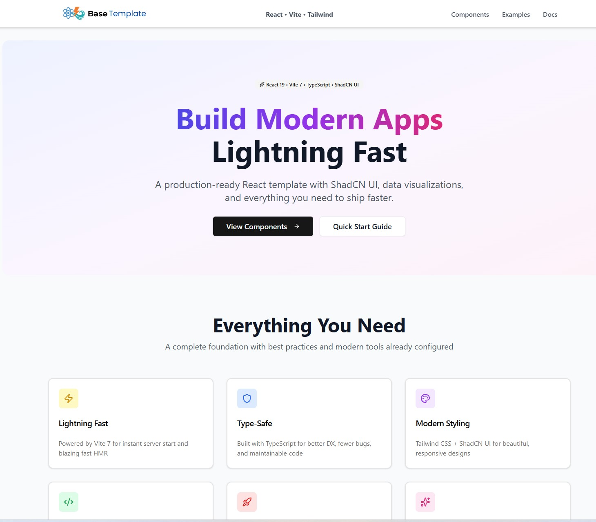
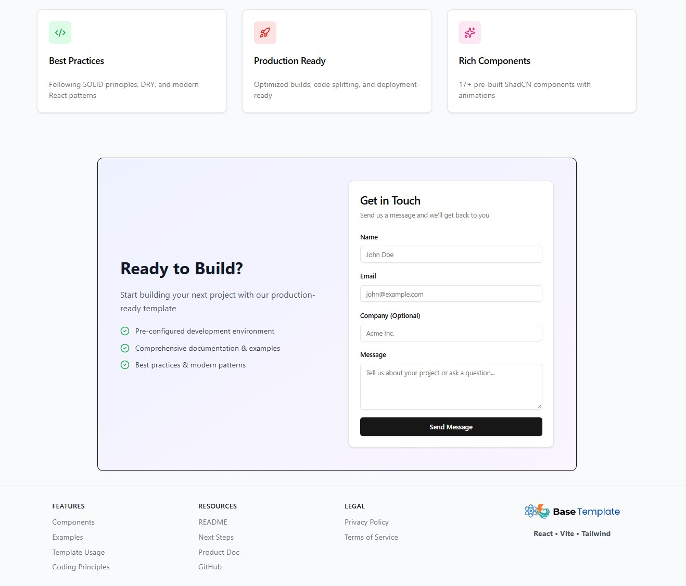
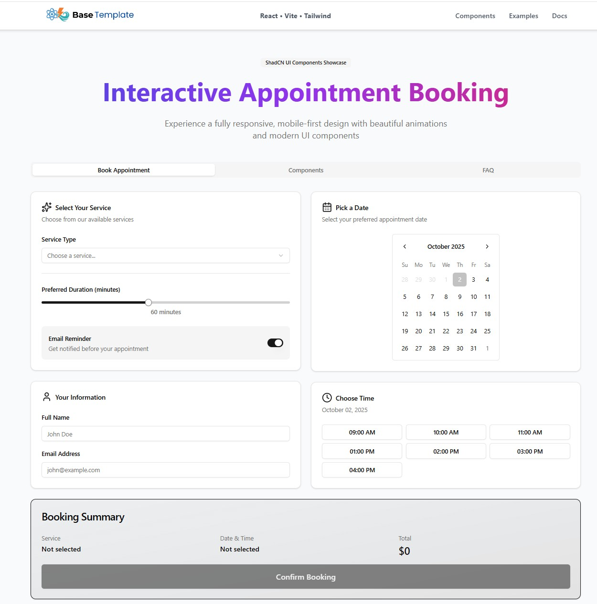

# React Vite Tailwind Base

**Last Updated:** October 2, 2025

A modern, production-ready React template with **ShadCN UI**, **data visualizations**, and a complete **interactive appointment booking showcase**. Built with best practices, mobile-first design, and beautiful animations.

---

## ✨ Highlights

🎨 **Interactive Components Showcase** - Full appointment booking system with calendar, time slots, and confirmation dialogs  
📊 **Data Visualization Dashboard** - Beautiful charts with Recharts (Area, Pie, Bar charts)  
🎯 **ShadCN UI Integration** - 17+ pre-built, accessible components  
📱 **Mobile-First & Responsive** - Optimized for all screen sizes  
⚡ **Lightning Fast** - Powered by Vite 7 with HMR  
🔒 **Type-Safe** - Full TypeScript support

---

## 📸 Screenshots

### Template Preview



### Interactive Appointment Booking



### Data Visualization Dashboard



---

## 🚀 Quick Start

```bash
# Install dependencies
pnpm install

# Start development server
pnpm dev

# Build for production
pnpm build

# Preview production build
pnpm preview
```

---

## 🎯 Tech Stack

### Core

- **React 19** - Latest React with concurrent features
- **TypeScript 5.8** - Full type safety
- **Vite 7** - Next-generation frontend tooling
- **Tailwind CSS 3.4** - Utility-first CSS framework

### UI & Components

- **ShadCN UI** - Beautifully designed components built with Radix UI
- **Lucide React** - Modern icon library (500+ icons)
- **Recharts** - Composable charting library
- **date-fns** - Modern date utility library
- **tailwindcss-animate** - Animation utilities

### Developer Experience

- **ESLint** - Code linting with React hooks rules
- **Prettier** - Code formatting
- **TypeScript ESLint** - TypeScript-specific linting
- **MSW** (Mock Service Worker) - API mocking for development

---

## 📦 Project Structure

```
src/
├── components/
│   ├── layout/          # Header, Footer
│   └── ui/              # ShadCN UI components (17 components)
├── pages/
│   ├── Components.tsx   # Interactive booking showcase + charts
│   ├── DocsPage.tsx     # Documentation viewer
│   ├── ExamplesPage.tsx # Code examples
│   ├── HomePage.tsx     # Landing page
│   └── ...              # Other pages
├── lib/
│   └── utils.ts         # Utility functions (cn, etc.)
├── docs/                # Markdown documentation
├── mocks/               # MSW mock handlers
└── App.tsx              # Main app with routing

```

---

## 🎨 Available Components (ShadCN UI)

- ✅ **Accordion** - Collapsible content sections
- ✅ **Alert** - Contextual feedback messages
- ✅ **Avatar** - User profile images with fallbacks
- ✅ **Badge** - Status indicators and labels
- ✅ **Button** - Multiple variants (default, outline, ghost, etc.)
- ✅ **Calendar** - Date picker with range selection
- ✅ **Card** - Content containers
- ✅ **Dialog** - Modal dialogs
- ✅ **Input** - Form inputs
- ✅ **Label** - Form labels
- ✅ **Progress** - Progress indicators
- ✅ **Select** - Dropdown selections
- ✅ **Separator** - Visual dividers
- ✅ **Slider** - Range inputs
- ✅ **Switch** - Toggle switches
- ✅ **Tabs** - Tabbed interfaces

---

## 🎨 Interactive Components Showcase

Visit `/components` to see a **fully functional appointment booking system** with real-time interactions!

### 📅 Appointment Booking System

A complete booking flow demonstrating ShadCN UI components in action:

- **Service Selection** - Dropdown with pricing and duration
- **Calendar Integration** - Date picker with disabled past dates
- **Time Slot Selection** - Interactive time slot buttons with availability
- **Duration Slider** - Adjustable appointment length (15-120 min)
- **User Information Form** - Name and email inputs with validation
- **Email Reminders** - Toggle switch for notifications
- **Booking Summary** - Real-time summary with pricing calculations
- **Confirmation Dialog** - Beautiful modal with animations, icons, and avatar

### 📊 Data Visualization Dashboard

Professional charts and statistics:

- **Stat Cards** - Revenue, Bookings, Active Clients, Avg. Session (with trend indicators)
- **Area Chart** - Revenue & Bookings trend over 6 months
- **Pie Chart** - Service distribution breakdown with percentages
- **Bar Chart** - Weekly appointment activity
- **Responsive Design** - All charts optimized for mobile devices

**Live Demo:** Run `pnpm dev` and visit `http://localhost:3000/components`

---

## 🛠️ Available Scripts

```bash
# Development
pnpm dev              # Start dev server
pnpm build            # Build for production
pnpm preview          # Preview production build

# Code Quality
pnpm lint             # Run ESLint
pnpm lint:fix         # Fix ESLint errors
pnpm typecheck        # Run TypeScript checks
pnpm format           # Format with Prettier
pnpm verify           # Run all checks + build

# Utilities
pnpm msw:init         # Initialize MSW
pnpm init:template    # Run template initialization script
```

---

## 🎨 Design Principles

This template follows modern web development best practices:

### Mobile-First Design

- Responsive layouts starting from mobile (320px+)
- Touch-friendly interactive elements
- Optimized for tablets and desktop

### Accessibility

- Semantic HTML structure
- ARIA labels and roles
- Keyboard navigation support
- Screen reader friendly

### Performance

- Code splitting and lazy loading
- Optimized bundle sizes
- Fast page loads with Vite
- Efficient re-renders

### Code Quality

- **SRP** (Single Responsibility Principle)
- **DRY** (Don't Repeat Yourself)
- **SoC** (Separation of Concerns)
- Immutable state patterns
- Graceful error handling

---

## 🔧 Configuration

### Path Aliases

```typescript
import { Button } from '@/components/ui/button';
import { utils } from '@/lib/utils';
```

### Tailwind Configuration

- Custom color schemes
- Typography plugin
- Animation utilities
- Dark mode support

### TypeScript

- Strict mode enabled
- Path mapping configured
- Full type coverage

---

## 📱 Responsive Breakpoints

```css
sm:  640px   /* Small devices (tablets) */
md:  768px   /* Medium devices (small laptops) */
lg:  1024px  /* Large devices (desktops) */
xl:  1280px  /* Extra large devices */
2xl: 1536px  /* 2X large devices */
```

Max container width: **7xl (80rem / 1280px)**

---

## 🎯 Use Cases

This template is perfect for:

- ✅ SaaS applications
- ✅ Admin dashboards
- ✅ Booking/scheduling systems
- ✅ Data visualization apps
- ✅ Component libraries
- ✅ Marketing websites
- ✅ Portfolio sites

---

## 📝 License

MIT License - feel free to use this template for personal or commercial projects.

---

## 🤝 Contributing

Contributions are welcome! Please feel free to submit a Pull Request.

1. Fork the repository
2. Create your feature branch (`git checkout -b feature/AmazingFeature`)
3. Commit your changes (`git commit -m 'Add some AmazingFeature'`)
4. Push to the branch (`git push origin feature/AmazingFeature`)
5. Open a Pull Request

---

## 📬 Contact

**Robert Cushman**

- GitHub: [@RCushmaniii](https://github.com/RCushmaniii)
- Repository: [react-vite-tailwind-base](https://github.com/RCushmaniii/react-vite-tailwind-base)

---

## ⭐ Show Your Support

Give a ⭐️ if this project helped you!

---

**Built with ❤️ using React, Vite, Tailwind CSS, and ShadCN UI**
