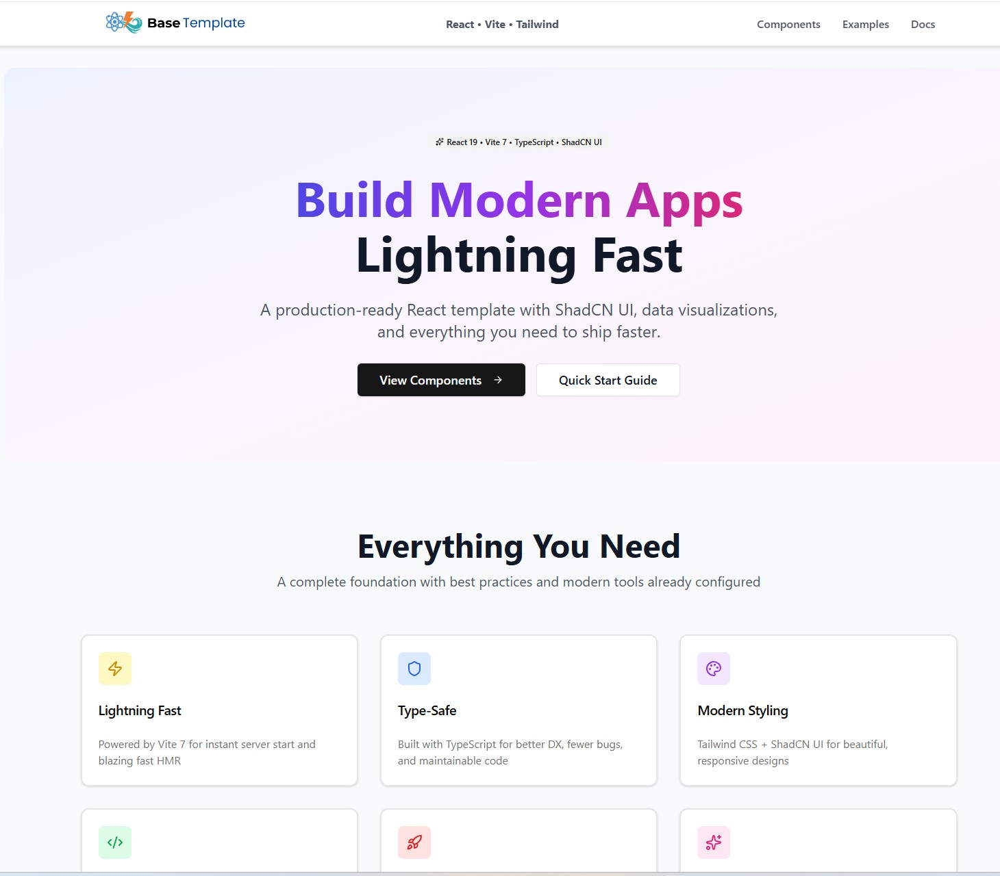
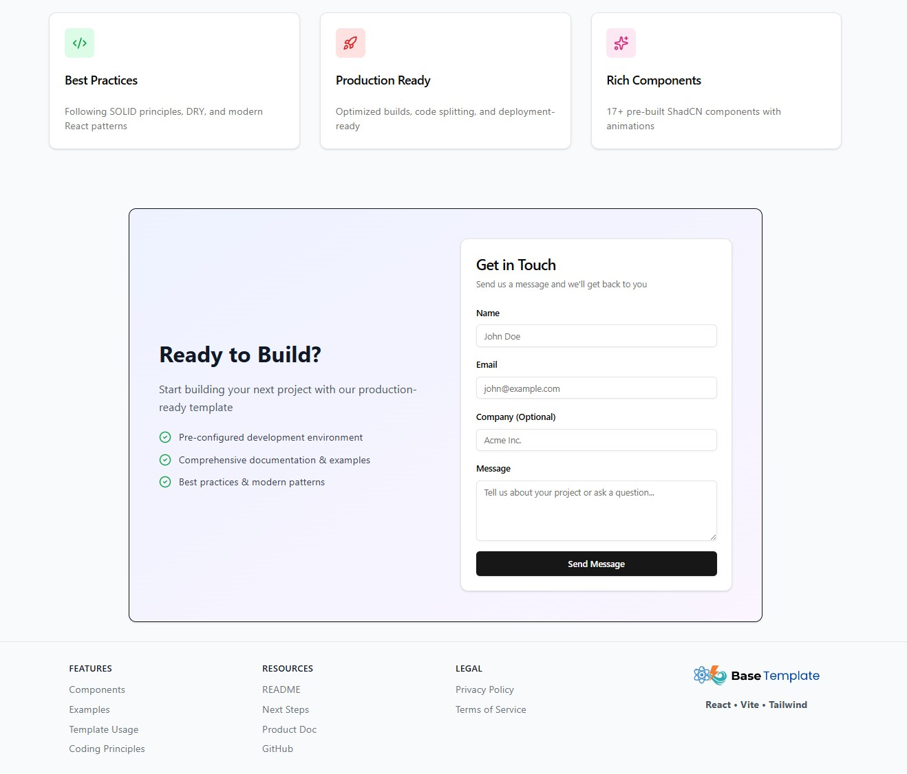
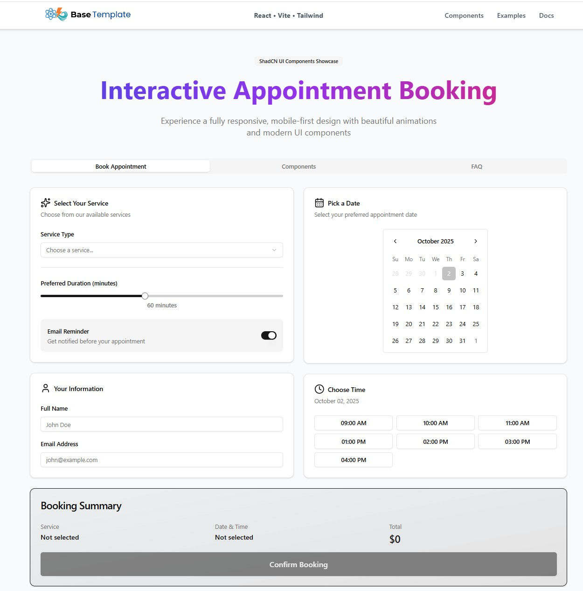

# React Vite Tailwind Base


> A production-ready React template with ShadCN UI, data visualizations, and a complete interactive appointment booking showcase.

## Overview

React Vite Tailwind Base is a modern starter template that ships with working features instead of empty scaffolding. It includes 17+ ShadCN UI components, an interactive appointment booking system, a data visualization dashboard with three chart types, and a documentation viewer — all wired up with real state management and responsive design.

The template eliminates the hours of boilerplate configuration that come with starting a new React project. TypeScript strict mode, ESLint, Prettier, path aliases, Tailwind theming, component libraries, routing, and API mocking are all pre-configured and ready to extend.

Built on React 19, Vite 7, and Tailwind CSS 4, it reflects current best practices without overengineering. Every dependency earns its place.

## The Challenge

Starting a new React project means assembling a long list of tools and configurations before writing a single feature: TypeScript setup, linting rules, formatting, path aliases, component libraries, routing, and theming. Most starter templates solve this with empty scaffolding that still leaves developers guessing at integration patterns.

The gap is not just the configuration — it's the lack of real examples showing how to compose components into working features, how to structure responsive layouts, and how to handle concerns like API mocking and secure markdown rendering.

## The Solution

This template provides a fully configured development environment alongside real feature implementations that demonstrate modern React patterns in practice:

- **Complete appointment booking flow** — service selection, calendar, time slots, duration slider, user form, and confirmation dialog, built entirely from composable ShadCN UI components
- **Data visualization dashboard** — three Recharts visualizations (area, pie, bar) integrated with responsive containers and Tailwind theming
- **API mocking with MSW** — full CRUD mock endpoints so frontend development doesn't depend on a backend
- **Secure markdown rendering** — parsed with `marked` and sanitized through DOMPurify before display

## Technical Highlights

- **Lazy-loaded routing:** Every page uses `React.lazy()` with Suspense, keeping the initial bundle small and loading pages on demand
- **XSS-safe markdown:** All rendered markdown is sanitized through DOMPurify to prevent injection attacks
- **17+ accessible components:** ShadCN UI (built on Radix UI) provides keyboard navigation, ARIA attributes, and screen reader support
- **Mobile-first responsive design:** Every component and layout is built from 320px up with touch-friendly interactions
- **Module-level constants:** Static data is defined outside component bodies to avoid unnecessary re-creation on renders
- **Code quality tooling:** ESLint, Prettier, TypeScript strict mode, and a `pnpm verify` command that runs all checks in sequence

## Getting Started

### Prerequisites

- Node.js >= 18
- pnpm (package manager)

### Installation

```powershell
# Clone the repository
git clone https://github.com/RCushmaniii/react-vite-tailwind-base.git
cd react-vite-tailwind-base

# Install dependencies
pnpm install

# Start development server (http://localhost:3000)
pnpm dev
```

### Environment Variables

| Variable | Default | Description |
|----------|---------|-------------|
| `VITE_ENABLE_MSW` | `true` | Enable/disable Mock Service Worker API mocking |

FormSpree form ID is configured in `src/pages/HomePage.tsx`. Replace with your own for production use.

## Live Demo

**[Try it live](https://react-vite-tailwind-base.vercel.app/)**

Test scenarios to explore:

1. **Appointment booking** — Visit `/components`, select a service, pick a date and time, fill in your info, and confirm. The full flow demonstrates 10+ ShadCN components working together.
2. **Data dashboard** — Switch to the "Components" tab to see area, pie, and bar charts with stat cards and trend indicators.
3. **API mocking** — Visit `/examples` to see MSW intercepting fetch requests and returning mock data.

### Screenshots


*Home page with hero section, feature cards, and contact form*


*Interactive booking flow with calendar, time slots, and service selection*


*Data visualization dashboard with area, pie, and bar charts*

## Project Structure

```
src/
├── components/
│   ├── layout/            # Header, Footer, LegalLayout, MarkdownContent
│   └── ui/                # ShadCN UI components (17 components)
├── pages/                 # Route-level page components (lazy-loaded)
│   ├── HomePage.tsx        # Landing page with contact form
│   ├── Components.tsx      # Booking showcase + charts + FAQ
│   ├── ExamplesPage.tsx    # MSW API integration demo
│   └── DocsPage.tsx        # Markdown documentation viewer
├── routes/                # React Router configuration
├── lib/                   # Utilities (cn, markdown loader, MSW setup)
├── mocks/                 # MSW handlers
├── examples/              # Example component + API handlers
└── docs/                  # Markdown documentation files
```

## Available Scripts

```powershell
pnpm dev              # Start dev server
pnpm build            # TypeScript check + production build
pnpm preview          # Preview production build
pnpm lint             # Run ESLint
pnpm lint:fix         # Auto-fix lint errors
pnpm typecheck        # TypeScript validation only
pnpm format           # Format with Prettier
pnpm verify           # Run typecheck + lint + build
```

## Results

This template reduces new project setup from hours of configuration to a single `pnpm install`. It provides working patterns for component composition, data visualization, API mocking, and secure content rendering that developers can reference and extend immediately.

| Metric | Value |
|--------|-------|
| Setup time | < 2 minutes |
| Pre-built components | 17+ ShadCN UI |
| Chart types | 3 (Area, Pie, Bar) |
| Lighthouse Performance | 90+ |
| TypeScript coverage | 100% strict mode |

## Contact

**Robert Cushman**
Business Solution Architect & Full-Stack Developer
Guadalajara, Mexico

📧 info@cushlabs.ai
🔗 [GitHub](https://github.com/RCushmaniii) • [LinkedIn](https://linkedin.com/in/robertcushman) • [Portfolio](https://cushlabs.ai)

## License

MIT License - Free to use for personal or commercial projects.

---

*Last Updated: 2026-02-22*
